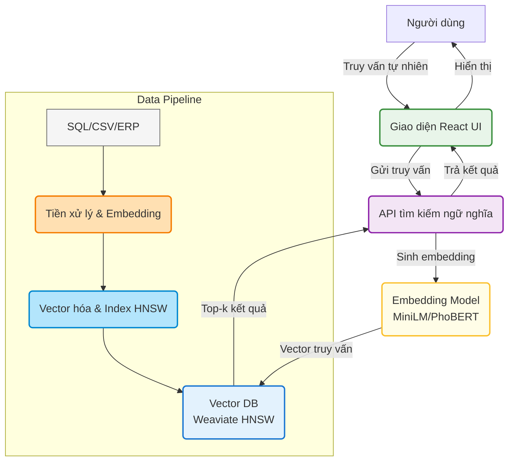
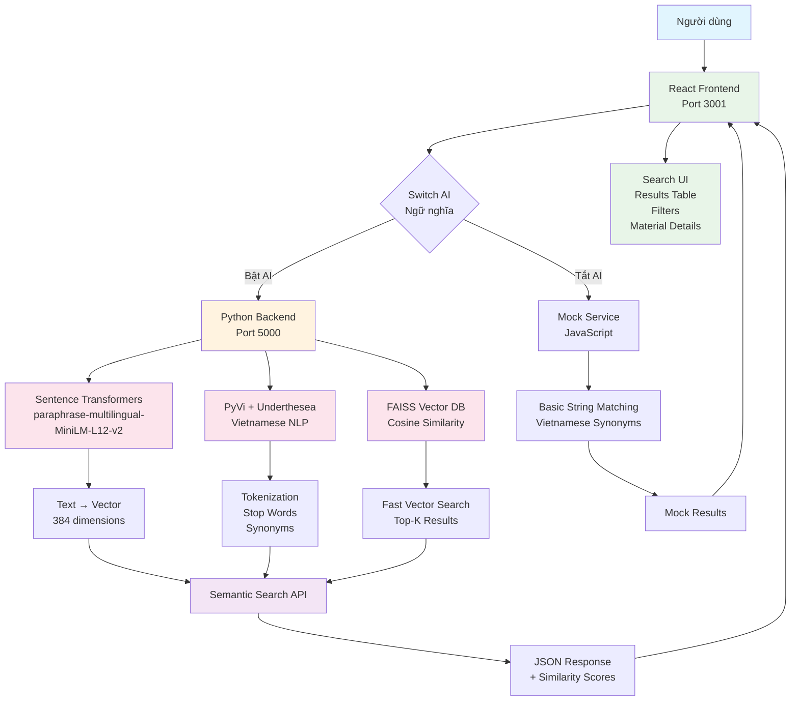
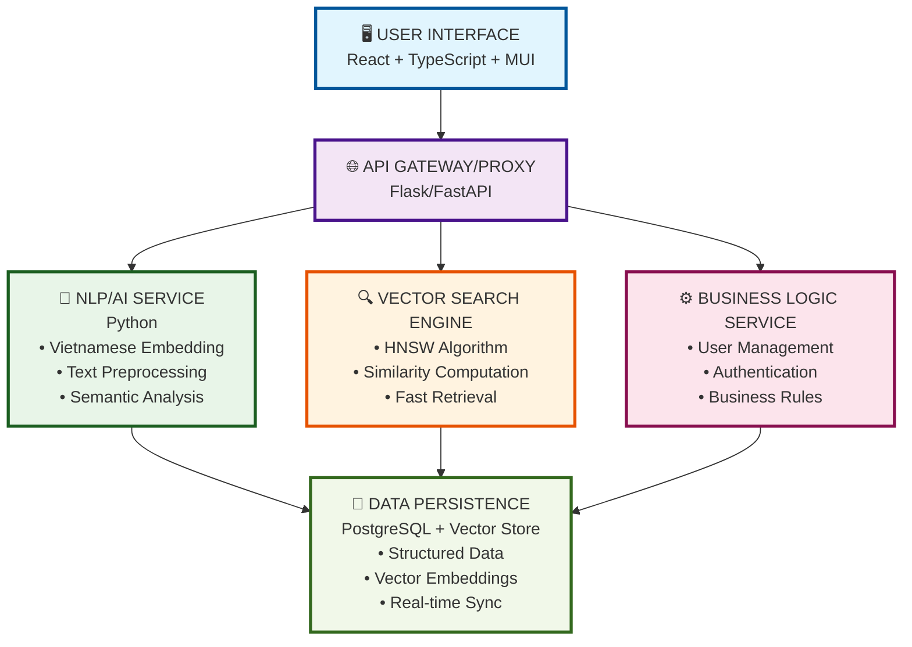

# Định hướng nghiên cứu & phát triển: Tìm kiếm ngữ nghĩa HNSW cho hệ thống quản lý kho

## 1. Mục tiêu nổi bật
- Tăng độ chính xác và tốc độ tìm kiếm vật tư trong kho lớn bằng công nghệ semantic search.
- Hiểu ý định tìm kiếm, gợi ý sản phẩm tương đồng về nghĩa, không phụ thuộc từ khóa cứng.
- Tích hợp HNSW (Hierarchical Navigable Small World) để tăng tốc truy vấn vector.

## 2. Sơ đồ kiến trúc tổng thể

## 3. Công nghệ & phương pháp
- **Embedding semantic:** Sentence Transformers (all-MiniLM-L6-v2), PhoBERT, FastText/Word2Vec.
- **Vector DB & Index:** Weaviate (HNSW), có thể mở rộng Milvus, Elasticsearch vector plugin.
- **Backend:** Python (Flask, FastAPI) hoặc .NET, tích hợp API tìm kiếm ngữ nghĩa.
- **Frontend:** React UI hiện tại, hỗ trợ tìm kiếm tự nhiên, xem tất cả vật tư, lọc nâng cao.

## 4. Quy trình triển khai chi tiết
### Bước 1: Thu thập & chuẩn hóa dữ liệu
- Trích xuất mô tả, metadata sản phẩm từ SQL/ERP/CSV.
- Làm sạch, chuẩn hóa, loại bỏ ký tự lạ, chuẩn UTF-8.

### Bước 2: Tiền xử lý & sinh embedding
- Gom các trường mô tả thành một chuỗi tổng hợp.
- Tokenize tiếng Việt (PyVi, underthesea).
- Sử dụng mô hình embedding (MiniLM, PhoBERT, v.v.) để chuyển thành vector.

### Bước 3: Xây dựng index HNSW
- Đưa vector và metadata vào Weaviate (hoặc Milvus) với chỉ mục HNSW.
- Kiểm tra khả năng truy vấn top-k nhanh.

### Bước 4: Thiết kế API tìm kiếm ngữ nghĩa
- Xây dựng API nhận truy vấn tiếng Việt, sinh embedding cho truy vấn.
- Truy vấn vector DB để lấy top-k vật tư gần nhất.
- Trả về metadata vật tư cho UI.

### Bước 5: Giao diện demo/tích hợp
- Giao diện React: nhập truy vấn, xem kết quả, lọc/sắp xếp, xem chi tiết vật tư.
- Có thể tích hợp vào hệ thống kho thực tế hoặc làm demo độc lập.

## 5. Lợi ích kỳ vọng
- Tăng tỷ lệ tìm đúng sản phẩm ≥ 90%.
- Tốc độ truy vấn trung bình ≤ 100ms.
- Tăng tỷ lệ click vào kết quả ≥ 30%.
- Mở rộng tích hợp vào e-commerce, CRM, logistics.

## 6. Định hướng mở rộng
- **Tìm kiếm đa ngôn ngữ** (multilingual search).
- **Gợi ý thông minh** dựa trên hành vi người dùng.
- **Phân tích ý định, cảm xúc** bằng AI.
- **Đo lường & dashboard:** Thêm module đo tốc độ, tỷ lệ tìm đúng, tỷ lệ click.

## 7. Đánh giá thành công
- Đo tốc độ truy vấn thực tế trên UI.
- Đo tỷ lệ tìm đúng qua bộ test truy vấn mẫu.
- Theo dõi tỷ lệ click và phản hồi người dùng.

---
**Liên kết codebase:**
- `src/App.tsx`: UI tìm kiếm ngữ nghĩa, xem tất cả vật tư.
- `src/components/MaterialList.tsx`: Bảng vật tư, lọc/sắp xếp.
- `src/services/weaviateService.ts`: Kết nối Weaviate, truy vấn HNSW.
- `public/materials_sample.json`: Dữ liệu mẫu.

**Ghi chú:**
- Có thể mở rộng thêm các module AI, dashboard đo lường, hoặc tích hợp với hệ thống lớn hơn.
- Đề xuất thử nghiệm nhiều mô hình embedding để tối ưu kết quả tìm kiếm. 
